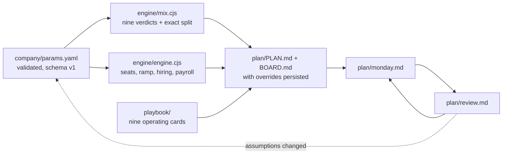

<div align="center">


[](https://github.com/awesbecher/pipeline-gen-as-code/actions/workflows/tests.yml)
[](LICENSE)
[](engine/)
[](skills/nine-engines/SKILL.md)

**The pipeline system I run at AI scale-ups, published as a repo your
AI agent can execute.**

[The board memo](examples/acme/BOARD.md) ·
[What it does](#what-this-is-and-what-it-is-not) ·
[Run it](#run-it) ·
[The engines](#the-nine-engines-methodology) ·
[Evidence](#tests-and-evidence) ·
[The operator](#the-operator)

</div>

---

## What this is, and what it is not

You are trying to decide where next quarter's pipeline comes from,
what it costs, and whether your team can staff the resulting meetings.
Most teams answer with the two channels their last company ran and a
slide of hope.

This repository is **an explainable starting model for pipeline engine
allocation and sales capacity at AI startups**. Give it your
parameters (ACV, cycle, team, monthly budget, constraints) and it
returns: a verdict on each of nine pipeline engines with the reason
and the exact inputs that produced it, an exact budget split, a
tested staffing model against your ARR target, a board memo, and a
weekly operating loop your AI agent runs with you.

The honest boundary, stated up front: the engine allocation and the
capacity model are two separate calculations. The split across
engines is a management starting hypothesis from fixed weights, not a
forecast; this version does not convert engine spend into meetings or
bookings. The capacity model answers a different question, whether
your target is staffable at all, and answers it with tested math.
Every threshold is a knob you are supposed to argue with.

**Three ways in:** read the
[finished board memo](examples/acme/BOARD.md) without installing
anything; [run it on your own numbers](#run-it) in about ten minutes;
or [hire the operator who built it](https://www.wesbecher.llc) to run
the system with you.

## The operator

Built by **[Andrew Wesbecher](https://www.wesbecher.llc)**: 26 years
of enterprise go-to-market and ten GTM plans built for AI and AI
security companies. From his record at
[wesbecher.llc/about](https://www.wesbecher.llc/about/): took
Traceable AI from $700K to $12M ARR in five quarters, and grew
Lacework from 2 accounts to more than 80 as its first global sales
leader. This repo is built from the operating principles he used in
those roles. The model did not produce those results and does not
claim it would; it encodes how he decides where pipeline comes from
and whether the team can carry it.

## Inputs, outputs, and limits

**Inputs**, validated against a versioned schema (invalid input exits
with field-specific errors; nothing fails open):

- Portfolio drivers, which decide engine verdicts: ACV, monthly
  pipeline budget, AE and GTM-engineer coverage, product self-serve
  shape, hard constraints.
- Capacity drivers, which feed the staffing model: sales cycle, ARR
  base and target, churn, expansion, current AEs, BDRs, and
  optionally SEs, leadership, and real ramp cohorts.
- Narrative context, which drives no verdict and says so: stage,
  funding, ICP, personas. If a field cannot change the answer, this
  repo will not pretend it does.

**Outputs:** the verdict table with reasons and decision inputs, exact
allocation in basis points with unallocated cash reported, the
capacity check with hiring schedule and payroll, a generated
[BOARD.md](examples/acme/BOARD.md) with downside, base, and upside
scenarios, and machine-readable JSON with versions, warnings, and
every assumption listed.

**Limits:** engine spend is not converted to meetings (yet); the model
constants are one operator's tested heuristics, indexed in
[docs/SOURCES.md](docs/SOURCES.md); current engine performance is
collected as context, annotated on verdicts, and not yet a model
input. When the model derives something you did not supply, it says
so in the output.

## The illustrative fixture

Acme Security is a made-up seed-stage company ($120K ACV, 178-day
cycle, 2 ramped and 2 ramping AEs, 1 BDR, $25K a month) committed
under [examples/acme/](examples/acme/) so you can inspect every
artifact without installing anything: the
[parameters](examples/acme/params.yaml), the
[JSON output](examples/acme/output.json), the
[board memo](examples/acme/BOARD.md), the
[90-day plan](examples/acme/PLAN.md), and one week of the
[Monday](examples/acme/monday.md) / [Friday](examples/acme/review.md)
loop including a persisted management override. These exact numbers
are pinned by the test suite; documentation cannot drift from the
model.

| Engine | Verdict | Monthly | Why (abridged; full reasons in the memo) |
|--------|---------|--------:|------------------------------------------|
| Automated Outbound | run now | $5,312 | Baseline layer; one owner exists |
| Product-Led Growth | defer | – | No self-serve surface |
| Manual Outbound + Cold Calling | run now | $7,970 | ACV clears the rep-led bar; already running |
| ABM | run now | $5,312 | Enterprise ACV, reps to route to |
| Community + Partner Led | instrument now | $1,875 | Slow flywheel; pays next year |
| Paid Media | defer | – | Split lands under its $8,000 learning floor |
| SEO + AEO | instrument now | $1,875 | No fast mode exists |
| Social Content | run now | $2,655 | The founder will post |
| Events | defer | – | Split lands under its $15,000 sponsorship floor |

Allocated $24,999 of $25,000; $1 unallocated rounding remainder,
reported, never hidden.

Read the two defers, because they are the change in this version. An
engine now has to clear its own minimum spend floor against the money
the split actually hands it, not merely qualify on ICP and budget. At
$25,000 a month, Events ($15,000 floor) and Paid Media ($8,000 floor)
never get there, so both drop to $0 and their share moves to the four
engines that clear their bar. Plainly: the model refuses to fund a
sponsorship program at $4,250.

The capacity check on the same inputs: gross capacity $6,991,639
against $6,960,000 needed, exit ARR $7,022,147, seven AE hires
(months 1, 1, 2, 2, 3, 3, 5), support build to 6 BDRs and 5 SEs,
sales payroll run rate $6,585,000, with every derived assumption
disclosed in the output. The board memo reports status per layer, AE
bookings capacity, BDR support, and overall staffing, so a plan that
books the number but cannot source the meetings shows up as its own
failure. BDR hiring follows the meeting plan the bookings target
implies, not the AE coverage ratio alone.

## The Nine Engines methodology

In this model, every new-logo first meeting maps to one of nine
engines. The playbook behind this repo covers all nine, how strong AI
companies run each one, and the numbers that say each is working,
with each claim indexed to a source or labeled an operator heuristic
in [docs/SOURCES.md](docs/SOURCES.md).

| # | Engine | Runs when (the model's rule) |
|---|--------|------------------------------|
| 01 | [Automated Outbound](playbook/01-automated-outbound.md) | Nearly always; needs one owner |
| 02 | [Product-Led Growth](playbook/02-plg.md) | A self-serve surface exists |
| 03 | [Manual Outbound + Cold Calling](playbook/03-manual-outbound.md) | ACV at $25K and up |
| 04 | [ABM](playbook/04-abm.md) | ACV at $75K and up, nameable market |
| 05 | [Community + Partner Led](playbook/05-community-partner.md) | Almost always, patiently |
| 06 | [Paid Media](playbook/06-paid-media.md) | ABM running, $8K+ a month |
| 07 | [SEO + AEO](playbook/07-seo-aeo.md) | Always, starting now |
| 08 | [Social Content](playbook/08-social-content.md) | The founder will post |
| 09 | [Events](playbook/09-events.md) | Enterprise ACV, real budget |

The portfolio stance: fund the fast engines to make this year's
number, instrument the slow, cheap ones (PLG, community and partner,
SEO and AEO) so next year's number costs less. The readable long-form
edition lives at
[wesbecher.llc/pipeline](https://www.wesbecher.llc/pipeline).



## Run it

Fastest path, from zero, in a terminal with
[Claude Code](https://claude.com/claude-code):

```bash
git clone https://github.com/awesbecher/pipeline-gen-as-code
cd pipeline-gen-as-code
claude
```

Say: **"Set up my pipeline plan."** The skill interviews you, writes
`company/params.yaml`, runs the validated models, and drafts your
plan and board memo. Or skip the agent entirely:

```bash
bin/nine-engines company/params.yaml              # verdicts + capacity
bin/nine-engines company/params.yaml --board      # your BOARD.md
bin/nine-engines --example                        # the Acme fixture, explicitly
```

The wrapper finds the engine from its own location, so it works from
any directory and needs no environment variables. `node
engine/run.cjs <path>` does the same thing.

**Claude Code plugin** (versioned installs, `/nine-engines:setup`,
`:monday`, `:review`; plugin code and your project state resolve
through separate paths, so an installed plugin never touches sample
data by accident):

```text
/plugin marketplace add awesbecher/pipeline-gen-as-code
/plugin install nine-engines@wesbecher
```

**Portable skill** for any agent that reads SKILL.md: copy
`skills/nine-engines/` into your skills directory. It bundles the
schema and decision rules, so it works standalone.

**Codex and ChatGPT desktop:** clone the repo; `AGENTS.md` briefs the
agent and `.agents/skills/nine-engines/` makes the skill discoverable
from a fresh clone. The manifest in `.codex-plugin/` passes OpenAI's
official plugin validator, which CI runs on every commit. We still say
clone-first rather than claiming plugin-install support, because a
clean end-to-end install through the Codex CLI has not been run yet.

Privacy, scoped honestly. The calculators are dependency-free Node
and run locally. They make no network calls, and your parameters and
plans stay on your disk, gitignored by default.

The assistant layer is a separate question. When you run this through
Claude Code, Cowork, Codex, or any MCP connector, that assistant and
those connectors process whatever you share with them under their own
provider policies, account tier, and retention settings. Confirm you
are working in an approved AI environment before you enter real ARR,
payroll, hiring, customer, or pipeline data. Details in
[docs/PRIVACY.md](docs/PRIVACY.md).

## Tests and evidence

No runtime dependencies; the engines run on bare Node (18, 20, and 22
on Ubuntu, 18 and 22 on macOS, all in CI).

```bash
npm test                        # all five suites
node engine/test-engine.cjs     # capacity: pinned fixtures plus swept invariants
node engine/test-mix.cjs        # verdicts, spend floors, constraint sweep
node engine/test-params.cjs     # schema: every fail-open case fails closed
node engine/test-docs.cjs       # README and plan numbers must match the fixtures
node engine/test-packaging.cjs  # captured stdout, ESM ancestor, manifests, skills
```

Two fixtures anchor the capacity model, by name. The
workbook-schedule fixture reproduces the source workbook's forced
hiring grid within a stated $50 tolerance (the workbook rounds
monthly cells to whole dollars; the model computes exactly, and the
exact values are pinned). The solver-default fixture pins the
solver's own outputs to the dollar. The full pin set lives in
[engine/fixtures.json](engine/fixtures.json), regenerated only by a
deliberate script, and the docs test fails if this README disagrees
with it.

Every benchmark in the playbook resolves to a claim ID in
[docs/SOURCES.md](docs/SOURCES.md) with source, evidence class, and
confidence; numbers with no source are labeled Andrew operator
heuristics, on purpose, rather than dressed up as industry data.

## The rules that travel with it

**A human approves every external send, in every engine, always.**
The agent drafts, queues, and reports; you own the send button. This
ships inside the skill, the runner, and every generated plan, and no
parameter file overrides it.

Management overrides are first-class: when you overrule a verdict,
the skill records the model recommendation, your decision, the
rationale, approver, and date, and re-applies your standing decisions
on every rerun.

## Wire your stack, if you want to

Optional MCP connections for the tools the engines run on (Clay,
Apollo, Attio, HubSpot, Stripe, and community servers for Instantly
and HeyReach) are documented in [docs/CONNECTORS.md](docs/CONNECTORS.md),
with pinned versions and API keys kept out of command history. None
of them are required; the plugin deliberately ships no MCP config.

## License

MIT. Fork it, run it, argue with the thresholds; they are knobs on
purpose, commented where they live in `engine/mix.cjs`.
