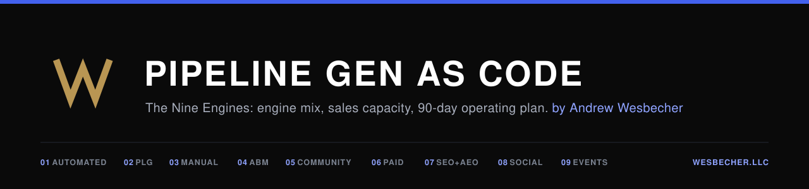
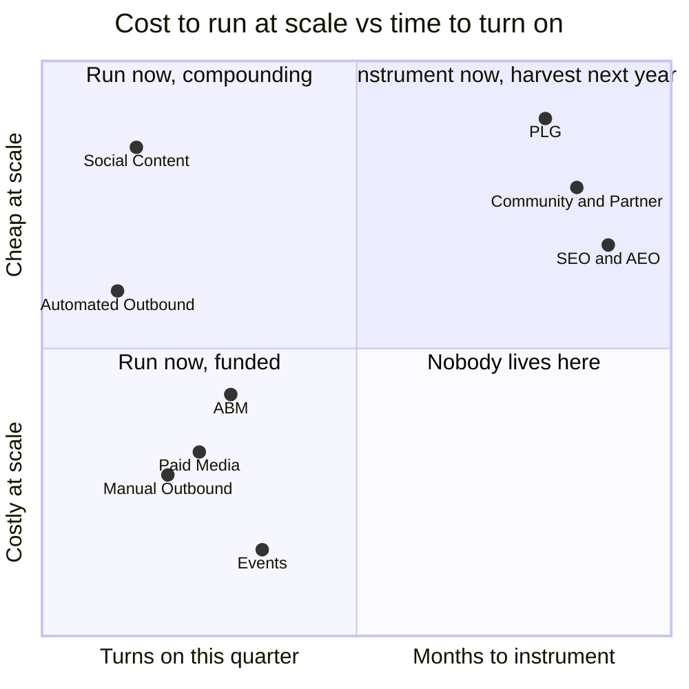
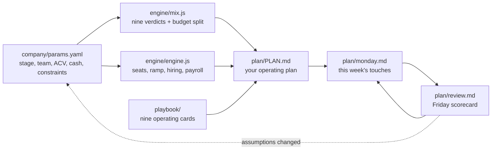

<div align="center">



[](https://github.com/awesbecher/masterclass-pipeline-gen/actions/workflows/tests.yml)
[](LICENSE)
[](engine/)
[](skills/nine-engines/SKILL.md)

**The pipeline system I run at AI scale-ups, published as a repo your
AI agent can execute.**

[Give it to Claude](#give-it-to-claude) ·
[What you get](#what-you-get) ·
[The engines](#the-nine-engines) ·
[How it works](#how-the-brain-works) ·
[Wire your stack](docs/CONNECTORS.md) ·
[The operator](#the-brain-behind-it)

</div>

---

Ask a founder how pipeline gets made and you get a channel list. Ask
where next quarter's meetings come from and the room gets quiet. Every
first meeting comes out of one of nine engines: automated outbound,
PLG, manual outbound, ABM, community and partner, paid media, SEO and
AEO, social content, events. Most teams run the two their last company
ran and call the rest experiments.

**The Masterclass Pipeline Generation Playbook** is the correction,
built to be run rather than read. Hand it to Claude with your
parameters (stage, ARR target, team, ACV, cycle, monthly budget) and
it returns the portfolio: which engines run now with what budget,
which get instrumented for next year, which get skipped with the
reason written down. A tested capacity model checks the plan is
staffable before you believe it, and a weekly loop keeps it honest
after you start.

## What you get

Real output, not a promise. This is `node engine/run.cjs` against the
example company in `company/params.example.yaml`: an AI security
startup at $120K ACV, a 178-day cycle, two ramped and two ramping AEs,
and $25K a month for pipeline.

| Engine | Verdict | Monthly | Why |
|--------|---------|--------:|-----|
| Automated Outbound | run now | $3,863 | The baseline layer: one GTM engineer, waterfall enrichment, warmed domains, human-approved sends. |
| Product-Led Growth | defer | – | No self-serve surface. Revisit when a free tier or trial exists. |
| Manual Outbound + Cold Calling | run now | $5,795 | ACV clears the bar for tiered, rep-led outbound. The deep-dive program is the operating manual. |
| ABM | run now | $3,863 | Enterprise ACV and reps to route to: named list, signal architecture, stage scoring. |
| Community + Partner Led | instrument now | $1,875 | Partner lane only: marketplace listing plus two or three co-sell relationships. |
| Paid Media | run now | $1,931 | Named list exists and budget clears the floor: full-funnel creative, demo asks only at warm retargeting. |
| SEO + AEO | instrument now | $1,875 | Start the clusters and versus pages now; AI-referred traffic converts about five times organic. |
| Social Content | run now | $1,931 | Three founder posts a week plus daily comments; capture engaged accounts into outbound. |
| Events | run now | $3,863 | Enterprise ICP: one or two ICP-dense events a quarter, half the meetings pre-booked. |

And because a plan that funds engines but cannot staff the meetings
fails in Q3, the same run checks the seat math:

```text
Steady-state per ramped AE: $999,996 a year.
Gross bookings needed for the bridge: $6,960,000.
Modeled gross capacity: $6,991,639 from 11 AEs (7 new: months 1, 1, 2, 2, 3, 3, 5).
Modeled exit ARR: $7,022,147.
Support build: 5 BDRs, 5 SEs. Sales payroll run rate: $6,465,000.
```

From there the skill writes `plan/PLAN.md` with the per-engine 90-day
build orders, owners, KPI bars, and tripwires, and the weekly loop
takes over.

## The nine engines

| # | Engine | Runs when | The bar |
|---|--------|-----------|---------|
| 01 | [Automated Outbound](playbook/01-automated-outbound.md) | Nearly always; needs one owner | 6 to 12 percent replies, enriched |
| 02 | [Product-Led Growth](playbook/02-plg.md) | Self-serve product exists | 8 percent median free-to-paid |
| 03 | [Manual Outbound + Cold Calling](playbook/03-manual-outbound.md) | ACV $25K and up | 2 to 3 percent dial-to-meeting |
| 04 | [ABM](playbook/04-abm.md) | ACV $75K and up, nameable market | 25 to 40 percent list engagement in 90 days |
| 05 | [Community + Partner Led](playbook/05-community-partner.md) | Almost always, patiently | 25 percent of new business at the year mark |
| 06 | [Paid Media](playbook/06-paid-media.md) | ABM list live, $8K+ a month | Cycles 15 to 30 percent faster |
| 07 | [SEO + AEO](playbook/07-seo-aeo.md) | Always, starting now | AI-referred converts ~5x organic |
| 08 | [Social Content](playbook/08-social-content.md) | The founder will post | Inbound ~3x inside 60 days |
| 09 | [Events](playbook/09-events.md) | Enterprise ACV, real budget | $2.5K to $5K per opportunity |

The portfolio verdict that frames all nine: PLG is the cheapest at
scale, then Community + Partner Led, then SEO and AEO. Those take
months to instrument. The other six you can turn on this quarter. So
fund the fast six to make this year's number, and instrument the cheap
three so next year's number costs less.



## How the brain works



Two deterministic engines do the math so the agent never improvises
numbers. `mix.js` maps your parameters onto the portfolio: every engine
gets a verdict (run_now, instrument_now, defer, or blocked), a written
reason you can argue with, and a budget share; run_now engines split 85
percent of monthly cash by weight, instrument_now engines split the
rest. `engine.js` is a full sales capacity model, ported from a
workbook and verified to the dollar: given your ACV, cycle, and seats
it computes ramp, hiring schedule, support build, payroll, and whether
your bookings target is physically reachable. A plan that funds engines
but cannot staff the resulting meetings fails in Q3, quietly; running
both is the point.

The agent layer sits on top: a portable skill interviews you, runs the
engines, and writes the plan from the nine operating cards. The weekly
loop (`monday` and `review`) turns it from a document into an operating
system, because the plan files are the memory.

## Give it to Claude

The fastest path, from zero, in any terminal with
[Claude Code](https://claude.com/claude-code):

```bash
git clone https://github.com/awesbecher/masterclass-pipeline-gen
cd masterclass-pipeline-gen
claude
```

Then say: **"Set up my pipeline plan."** `CLAUDE.md` briefs the agent,
the skill runs the interview, and your plan lands in `plan/`. That is
the whole setup.

Three install paths, by depth:

**1. Plugin (Claude Code).** Versioned installs and the workflow
skills as commands:

```text
/plugin marketplace add awesbecher/masterclass-pipeline-gen
/plugin install nine-engines@wesbecher
```

Then `/nine-engines:setup`, `/nine-engines:monday`,
`/nine-engines:review`.

**2. Portable skill (any agent that reads SKILL.md).** Copy
`skills/nine-engines/` into your skills directory: `.claude/skills/`
(Claude Code), `.agents/skills/` (Codex CLI), `.github/skills/`
(Copilot), or `.gemini/skills/` (Gemini CLI). Then ask for a pipeline
plan. The skill carries compressed decision rules, so it works even
without the rest of the repo.

**3. The full brain (recommended).** Clone, as above. Claude Code and
Cowork read `CLAUDE.md`; Codex and ChatGPT desktop read the mirrored
`AGENTS.md` and the `.codex-plugin/` and `.agents/` manifests. Your
parameters live in `company/params.yaml`, your plan in `plan/`, and
the weekly loop compounds week over week. Running a private clone as
your operating system: un-ignore `plan/` and `company/params.yaml` in
`.gitignore` and commit your state, so the memory travels with the
repo.

## What is in the box

```text
skills/nine-engines/     the operating procedure (SKILL.md + references:
                         intake interview, decision rules, plan templates)
skills/{setup,monday,review}/  the three workflow commands
playbook/                the nine engine cards: flows, benchmarks,
                         stacks, first 90 days, tripwires
engine/                  the math: mix.js, engine.js, run.cjs CLI,
                         49 tests between them
company/                 params.example.yaml, the intake schema
docs/CONNECTORS.md       wiring Clay, Apollo, Attio, HubSpot, Stripe,
                         Instantly, HeyReach over MCP
plan/                    your generated plan lives here (gitignored)
assets/                  banner and social card, Electric Studio spec
CLAUDE.md · AGENTS.md    the runtime brief, mirrored for both ecosystems
```

## The math is tested

No dependencies anywhere; everything runs on bare Node.

```bash
node engine/run.cjs            # verdicts + capacity check, markdown
node engine/run.cjs --json     # same, machine-readable
node engine/test-engine.cjs    # capacity model: 29 tests
node engine/test-mix.cjs       # portfolio logic: 20 tests
```

The capacity model reproduces its source workbook to the dollar: the
default scenario must produce gross capacity of $6,958,328 and exit ARR
of $7,000,830, and CI fails if it ever does not. Thresholds in `mix.js`
(the $25K manual bar, the $75K enterprise line, the $8K paid floor) are
knobs on purpose, commented where they live; argue with them, then
change them.

## The rules that travel with it

**A human approves every external send, in every engine, always.** The
agent drafts, queues, and reports; you own the send button. This ships
inside the skill, the runtime brief, and every generated plan, and no
parameter file overrides it.

Benchmark ranges are directional, drawn from operating experience; the
2026 market data is industry-reported. Validate against your own funnel
before you build a forecast on any of them.

## The brain behind it

This playbook is by **[Andrew Wesbecher](https://www.wesbecher.llc)**:
26 years of enterprise go-to-market and ten GTM plans built for AI and
AI security companies. This repo is the runnable edition of the system
he operates.

The readable editions live on his site: the full
[pipeline playbook](https://www.wesbecher.llc/pipeline), the
[sales playbook for AI scale-ups](https://www.wesbecher.llc/playbook),
and the [capacity model as an interactive app](https://www.wesbecher.llc/capacity),
which is the same math as `engine/engine.js`.

Running GTM for an AI company and want the operator, not just the
repo: [www.wesbecher.llc](https://www.wesbecher.llc).

## License

MIT. Fork it, run it, ship pipeline with it.
